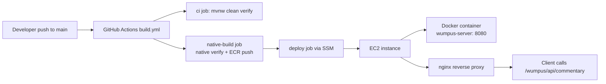

# Deployment Architecture
## Goal
`wumpus-server` is deployed as a Quarkus native container on EC2 and exposed through the existing HTTPS endpoint at `https://api.rwars.steven-webber.com/wumpus/...`.

## Architecture overview


## Runtime topology
- The Quarkus service listens on container port `8080`.
- The EC2 host maps host port `8081` to container port `8080`.
- nginx handles TLS and routes `/wumpus/*` to `http://localhost:8081/`.
- The trailing slash in `proxy_pass http://localhost:8081/;` is required so nginx strips the `/wumpus` prefix before forwarding to the service.

## What is already implemented in this repository
- Build + deployment workflow in `.github/workflows/build.yml`.
- Maven-based project using wrapper scripts (`mvnw`, `mvnw.cmd`).
- Native Docker image build using `src/main/docker/Dockerfile.native`.
- App/runtime config in `src/main/resources/application.properties`:
  - HTTP port `8080`
  - health/openapi/swagger endpoints enabled
  - CORS enabled
- Deployment behavior in workflow:
  - `ci` job runs for PRs, pushes, and manual dispatch.
  - `native-build` and `deploy` run only on `push` to `main`.
  - `native-build` compiles native once, then builds and pushes Docker image tags.
  - Deploy job uses AWS SSM Run Command to pull latest image and restart the container.
  - Deploy validates health with `curl -sf http://localhost:8081/q/health`.

## One-time setup required outside this repository
### 1) GitHub repo settings
Configure the following in GitHub Actions settings:

Required secret:
- `AWS_ROLE_ARN`
- `AWS_BEARER_TOKEN_BEDROCK`

Required variable:
- `EC2_INSTANCE_ID`

Optional variables:
- `AWS_REGION` (default: `af-south-1`)
- `WUMPUS_ECR_REPOSITORY` (default: `wumpus-server`)
- `WUMPUS_CONTAINER_NAME` (default: `wumpus-server`)
- `WUMPUS_CONTAINER_PORT` (default: `8081`)
- `WUMPUS_BEDROCK_REGION` (default: `us-east-1`)
- `WUMPUS_BEDROCK_MODEL_ID` (default: `us.amazon.nova-lite-v1:0`)

### 2) AWS OIDC trust for GitHub Actions
The IAM role referenced by `AWS_ROLE_ARN` must trust GitHub's OIDC provider and allow this repository to call `sts:AssumeRoleWithWebIdentity`.

If `robot-wars` already works, mirror that trust policy and add `Wumpus-server` repository subject(s), for example:

```json
{
  "Version": "2012-10-17",
  "Statement": [
    {
      "Effect": "Allow",
      "Principal": {
        "Federated": "arn:aws:iam::<ACCOUNT_ID>:oidc-provider/token.actions.githubusercontent.com"
      },
      "Action": "sts:AssumeRoleWithWebIdentity",
      "Condition": {
        "StringEquals": {
          "token.actions.githubusercontent.com:aud": "sts.amazonaws.com"
        },
        "StringLike": {
          "token.actions.githubusercontent.com:sub": [
            "repo:steven-ww/Wumpus-server:ref:refs/heads/main"
          ]
        }
      }
    }
  ]
}
```

The role policy must also allow:
- ECR auth/push/pull needed by the workflow
- SSM command execution and command result retrieval for the target instance

### 3) EC2 host prerequisites
The target instance must have:
- Docker installed and running
- AWS SSM agent installed and online
- Permission for the instance profile to pull from ECR (or successful login by SSM command)
- Port `8081` available for the container mapping

### 4) One-time nginx route setup
Apply the nginx `/wumpus` route once (via SSM/manual shell), then reload nginx:

```nginx
location /wumpus/ {
  proxy_pass http://localhost:8081/;
  proxy_http_version 1.1;
  proxy_set_header Host $host;
  proxy_set_header X-Real-IP $remote_addr;
}
```

## Recurring deployment sequence (after one-time setup)
1. Push to `main`.
2. GitHub Actions runs `ci` (`./mvnw -B clean verify`).
3. `native-build` compiles and verifies native once (`./mvnw -B -Dnative -Dquarkus.native.container-build=true verify`).
4. In the same `native-build` job, Docker image is built and pushed to ECR as:
   - `latest`
   - `<commit-sha>`
5. Deploy job sends SSM command to EC2:
   - login to ECR
   - pull latest image
   - remove old container
   - start new container with `--restart unless-stopped`, injecting Bedrock runtime env (`WUMPUS_BEDROCK_REGION`, `WUMPUS_BEDROCK_MODEL_ID`, `AWS_BEARER_TOKEN_BEDROCK`)
   - run health check on `localhost:8081/q/health`

## Operational validation
Use these smoke tests after deployment:

1. EC2 host local health:
`curl -sf http://localhost:8081/q/health`

2. Public routed health:
`curl -sf https://api.rwars.steven-webber.com/wumpus/q/health`

3. Commentary endpoint:
`curl -sf -X POST https://api.rwars.steven-webber.com/wumpus/api/commentary -H 'Content-Type: application/json' -d '{\"action\":\"MOVE\",\"targetRoom\":5,\"outcome\":\"SAFE\",\"playerRoom\":5,\"adjacentRooms\":[1,2,3]}'`

Expected response shape:
`{\"commentary\":\"...\",\"fallback\":true}`
